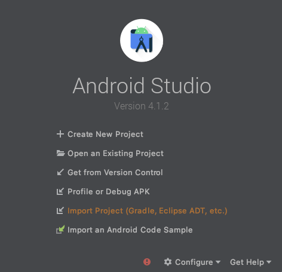
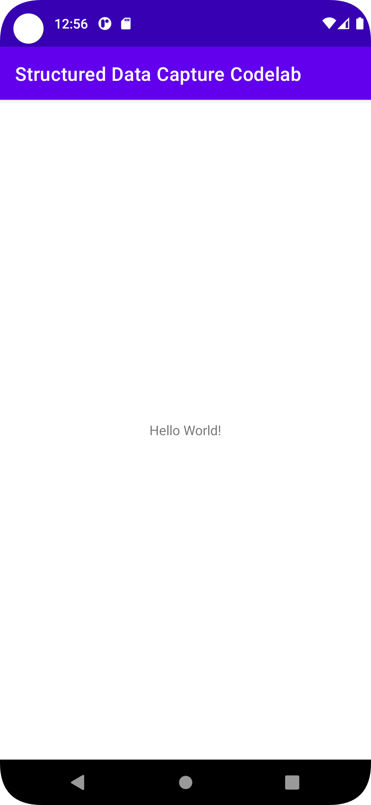
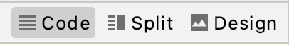
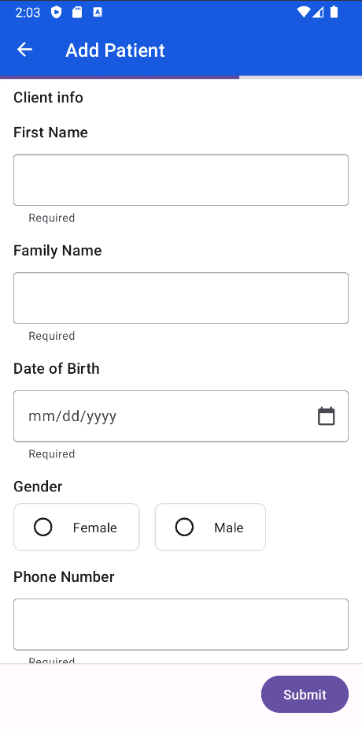

# Capture and process health data with Structured Data Capture Library

## 1. Before you begin

### What you'll build

In this codelab, you're going to build an Android app with Structured Data
Capture Library. Your app will use the Structured Data Capture Library to render
and process FHIR Questionnaires and responses.

### What you'll learn

*   How to integrate Structured Data Capture Library into your Android
    application
*   How to display a Questionnaire
*   How to get answers as a QuestionnaireResponse
*   How to extract FHIR resources from a QuestionnaireResponse

### What you'll need

*   A recent version of [Android Studio (v4.1.2+)](https://developer.android.com/studio)
*   [Android Emulator](https://developer.android.com/studio/run/emulator) or a physical Android device
*   The sample code
*   Basic knowledge of Android development in Kotlin

This codelab is focused on [Structured Data Capture Library](https://github.com/google/android-fhir/tree/master/datacapture). Non-relevant
concepts and code blocks are glossed over and are provided for you to simply
copy and paste. If you haven't built Android apps before, you can start by
[building your first app](https://developer.android.com/training/basics/firstapp).

## 2. Get set up

### Download the Code

To download the code for this codelab, clone the Android FHIR SDK repo:
`git clone https://github.com/google/android-fhir.git`

The starter project for this codelab is located in `codelabs/datacapture`.

### Import the app into Android Studio

Let's start by importing the starter app into Android Studio.

Open Android Studio, select **Import Project (Gradle, Eclipse ADT, etc.)** and
choose the `codelabs/datacapture` folder from the source code that you have downloaded
earlier.



### Run the starter app

Now that you have imported the project into Android Studio, you are ready to run the app
for the first time.

Connect your Android device via USB to your host, or
[Start the Android Studio emulator,](https://developer.android.com/studio/run/emulator)
and click Run () in the Android
Studio toolbar.

<p align="left">

</p>

As you can see there isn't much here yet, so let's get right into displaying a
questionnaire in your app!

## 3. Add Structured Data Capture Library to the project

### Add the dependencies for Structured Data Capture Library

The Structured Data Capture Library dependencies allow you to integrate the
Structured Data Capture Library in your app. Add the following lines to the end
of the `app/build.gradle.kts` file of your project:

```kotlin
dependencies {
    // ...

    implementation("com.google.android.fhir:data-capture:0.1.0-beta03")
    implementation("androidx.fragment:fragment-ktx:1.4.1")
}
```

### Sync your project with Gradle files

To be sure that all dependencies are available to your app, you should sync your
project with gradle files at this point.

Select **Sync Project with Gradle Files**
() from the Android Studio
toolbar. You an also run the app again to check the dependencies are working correctly.

## 4. Display a Questionnaire

In this step, you will add the functionality to the starter app to render a
questionnaire in a [`FragmentContainerView`](https://developer.android.com/reference/androidx/fragment/app/FragmentContainerView).

Along the way, Android Studio will prompt you to add the necessary imports:

*   `androidx.core.os.bundleOf`
*   `androidx.fragment.app.add`
*   `androidx.fragment.app.commit`
*   `com.google.android.fhir.datacapture.QuestionnaireFragment`

### Step 1: Add a FragmentContainerView

Add a `FragmentContainerView` to the application's layout. This is where the
`QuestionnaireFragment` that you will create later will be displayed.

1.  Open `activity_main.xml` (**res > layout > activity\_main.xml**).
2.  Find the options for Code, Split, and Design views in the upper right of the
    Layout Editor.
3.  Select the Code view.\
    
4.  You don't need the `TextView`, so delete it. Be sure to delete everything
    from the `<TextView` to the closing `/>`.
5.  Add a `FragmentContainerView` inside the `ConstraintLayout`. Your
    `activity_main.xml` file should look like this:

    ```xml
    <?xml version="1.0" encoding="utf-8"?>
    <androidx.constraintlayout.widget.ConstraintLayout
    xmlns:android="http://schemas.android.com/apk/res/android"
    xmlns:app="http://schemas.android.com/apk/res-auto"
    android:layout_width="match_parent"
    android:layout_height="match_parent">

    <androidx.fragment.app.FragmentContainerView
        android:id="@+id/fragment_container_view"
        android:layout_width="match_parent"
        android:layout_height="match_parent"
        app:layout_constraintTop_toTopOf="parent" />

    </androidx.constraintlayout.widget.ConstraintLayout>
    ```

### Step 2: Configure a QuestionnaireFragment

`QuestionnaireFragment` requires a JSON encoded FHIR Questionnaire for it to
render. Since the questionnaire is small (&lt;512 KB), you will include it as a
`String` in a `Bundle` of arguments that will be used to create the fragment.
Larger questionnaires should be provided as a `URI` for performance reasons.

You can look at the `questionnaire.json` file if you want, but one of the
benefits of the Structured Data Capture Library is that you don't need to know
the structure of the FHIR Questionnaire (or anything about FHIR) to get it to
render it! You'll look more closely at this file later in the codelab.

Open `MainActivity.kt` and add the following code to the `MainActivity` class:

```kotlin
// Step 2: Configure a QuestionnaireFragment
val questionnaireJsonString = getStringFromAssets("questionnaire.json")

val questionnaireParams = bundleOf(
QuestionnaireFragment.EXTRA_QUESTIONNAIRE_JSON_STRING to questionnaireJsonString
)
```

### Step 3: Add the QuestionnaireFragment to the FragmentContainerView

To display the `QuestionnaireFragment` within the layout container, use the
`FragmentManager` to create a `FragmentTransaction`. The `FragmentManager`
handles instantiation using the previously created `questionnaireParams`.

Add the following code to the `MainActivity` class:

```kotlin
// Step 3: Add the QuestionnaireFragment to the FragmentContainerView
if (savedInstanceState == null) {
    supportFragmentManager.commit {
        setReorderingAllowed(true)
        add<QuestionnaireFragment>(R.id.fragment_container_view, args = questionnaireParams)
    }
}
```

Learn more about
[how to use fragments](https://developer.android.com/guide/fragments).

Let's run the codelab by clicking Run
() in the Android Studio toolbar.
You should see something similar to this:

<p align="left">

</p>

Navigate through the questionnaire and try entering some answers. There are a
few different answer widgets used, including booleans, text, and dates, which
were automatically rendered based on the underlying type in the original FHIR
questionnaire.

*Technically, that's all you need to do to render a questionnaire!
Congratulations!*

A questionnaire isn't very helpful if you can't see the answers that users input
though. Let's go on to the next step of getting a Questionnaire Response!

## 5. Get a Questionnaire Response

In the previous steps, you rendered a FHIR questionnaire in your app.

In this section, you'll get the answers from the questionnaire as a
QuestionnaireResponse.

Find the `submitQuestionnaire()` method and add the following code:

```kotlin
// Get a questionnaire response
val fragment = supportFragmentManager.findFragmentById(R.id.fragment_container_view)
        as QuestionnaireFragment
val questionnaireResponse = fragment.getQuestionnaireResponse()

// Print the response to the log
val jsonParser = FhirContext.forCached(FhirVersionEnum.R4).newJsonParser()
val questionnaireResponseString =
    jsonParser.encodeResourceToString(questionnaireResponse)
Log.d("response", questionnaireResponseString)
```

To get the questionnaire response, you retrieve the questionnaire fragment
created earlier then use the `getQuestionnaireResponse()` method. This returns a
HAPI FHIR
<code>[QuestionnaireResponse](https://hapifhir.io/hapi-fhir/apidocs/hapi-fhir-structures-r4/org/hl7/fhir/r4/model/QuestionnaireResponse.html)</code>
which you can use directly or with other parts of the Android FHIR SDK. This
codelab uses other HAPI FHIR libraries to convert it to a JSON string to view in
the log.

## 6. Extract FHIR Resources from a QuestionnaireResponse

The questionnaire included with the starter project is for a simple patient
registration flow, so you may ultimately want to use the questionnaire responses
to create a [FHIR Patient resource](https://www.hl7.org/fhir/patient.html) based
on them. This conversion from a questionnaire response to FHIR resources is
called [data extraction](http://hl7.org/fhir/uv/sdc/extraction.html). We can do
this with the `ResourceMapper` class of the Structured Data Capture Library.

To perform data extraction, your questionnaire must be authored to include
information on how to perform the data extraction. Luckily, the sample
questionnaire is already set up for
[Definition-based extraction](http://hl7.org/fhir/uv/sdc/extraction.html#definition-based-extraction).

Find the `submitQuestionnaire()` method and add the following code:

```kotlin
lifecycleScope.launch {
  val questionnaire =
    jsonParser.parseResource(questionnaireJsonString) as Questionnaire
  val bundle = ResourceMapper.extract(questionnaire, questionnaireResponse)
  Log.d("extraction result", jsonParser.encodeResourceToString(bundle))
}
```

`ResourceMapper.extract()` requires a HAPI FHIR Questionnaire, which you can
create by parsing the questionnaire JSON string from earlier, and a
QuestionnaireResponse, which we already got earlier. It returns a HAPI FHIR
transaction
[Bundle](https://hapifhir.io/hapi-fhir/apidocs/hapi-fhir-structures-r4/org/hl7/fhir/r4/model/Bundle.html)
containing one or more extracted resources–in this case a single Patient
resource.

## 7. Congratulations!

You have used the Structured Data Capture Library to process FHIR questionnaires
and responses in your app:

*   Display a Questionnaire
*   Get a Questionnaire Response
*   Extract FHIR Resources from a QuestionnaireResponse

That is all you need to get it up and running!

As you proceed, you might like to work with FHIR resources in more ways
throughout your application. Check out the
[FHIR Engine Library](https://github.com/google/android-fhir/wiki/FHIR-Engine-Library)
of the Android FHIR SDK to learn how to store and manage FHIR resources locally
in your application and synchronize data with a remote FHIR server.

### What we've covered

*   How to add Structured Data Capture Library to your Android app
*   How to use `QuestionnaireFragment` and `ResourceMapper` to work with FHIR
    questionnaires

### Next Steps

*   Explore the documentation for the Structured Data Capture Library
*   Customize the look and feel of rendered questionnaires
*   Apply the Structured Data Capture Library in your own Android app

### Learn More

https://github.com/google/android-fhir/wiki/Structured-Data-Capture-Library
