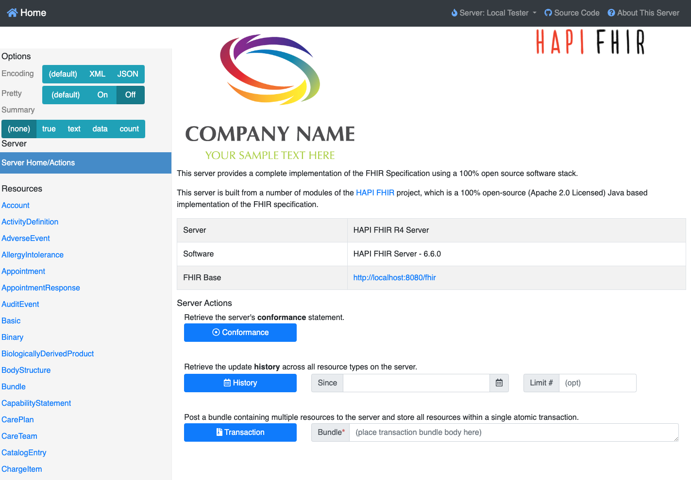
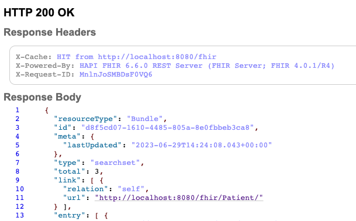
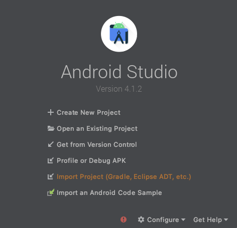
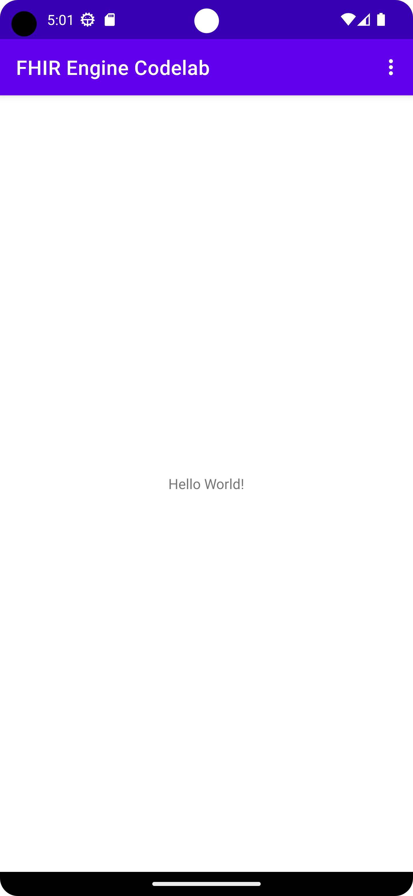
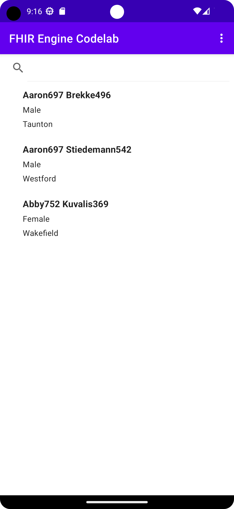

# Manage FHIR resources using FHIR Engine Library

## Before you begin

### What you'll build

In this codelab, you'll build an Android app using FHIR Engine Library. Your app
will use FHIR Engine Library to download FHIR resources from a FHIR server, and
upload any local changes to the server.

### What you'll learn

*   How to create a local HAPI FHIR server using Docker
*   How to integrate FHIR Engine Library into your Android application
*   How to use the Sync API to set up a one-time or periodic job to download and
    upload FHIR resources
*   How to use the Search API
*   How to use the Data Access APIs to create, read, update, and delete FHIR
    resources locally

### What you'll need

*   Docker ([get Docker](https://docs.docker.com/get-docker/))
*   A recent version of
    [Android Studio (v4.1.2+)](https://developer.android.com/studio)
*   [Android Emulator](https://developer.android.com/studio/run/emulator) or a
    physical Android device running Android 7.0 Nougat or later
*   The sample code
*   Basic knowledge of Android development in Kotlin

If you haven't built Android apps before, you can
start by [building your first
app](https://developer.android.com/training/basics/firstapp).

## Set up a local HAPI FHIR server with test data

[HAPI FHIR](https://hapifhir.io/hapi-fhir/) is a popular open-source FHIR
server. We will use a local HAPI FHIR server in our codelab for the Android app
to connect to.

### Set up the local HAPI FHIR server

1.   Run the following command in a terminal to get the latest image of HAPI
     FHIR

```shell
docker pull hapiproject/hapi:latest
```

2.   Create a HAPI FHIR container by either
     using Docker Desktop to run the previously download image `hapiproject/hapi`, or
     running the following command

```shell
docker run -p 8080:8080 hapiproject/hapi:latest
```

Learn [more](https://github.com/hapifhir/hapi-fhir-jpaserver-starter#running-via-docker-hub).

3. Inspect the server by opening the URL `http://localhost:8080/` in a browser.
   You should see the HAPI FHIR web interface.



### Populate the local HAPI FHIR server with test data

To test our application, we'll need some test data on the server. We'll use
synthetic data generated by Synthea.

1.   First, we need to download sample data from [synthea-samples](
     https://github.com/synthetichealth/synthea-sample-data/tree/master/downloads).
     Download and unzip `synthea_sample_data_fhir_r4_sep2019.zip`. The un-zipped
     sample data has numerous `.json` files, each being a transaction bundle for an
     individual patient.

2.   We'll upload test data for three patients to the local HAPI FHIR server.
     Run the following command in the directory containing JSON files

```shell
curl -X POST -H "Content-Type: application/json" -d @./Aaron697_Brekke496_2fa15bc7-8866-461a-9000-f739e425860a.json http://localhost:8080/fhir/
curl -X POST -H "Content-Type: application/json" -d @./Aaron697_Stiedemann542_41166989-975d-4d17-b9de-17f94cb3eec1.json http://localhost:8080/fhir/
curl -X POST -H "Content-Type: application/json" -d @./Abby752_Kuvalis369_2b083021-e93f-4991-bf49-fd4f20060ef8.json http://localhost:8080/fhir/
```

3.   To upload test data for all patients to the server, run

```shell
for f in *.json; do curl -X POST -H "Content-Type: application/json" -d @$f http://localhost:8080/fhir/ ; done
```

However, this can take a long time to complete and is not necessary for the
codelab.

4. Verify that the test data is available on the server by opening the URL
   `http://localhost:8080/fhir/Patient/` in a browser. You should see the text
   `HTTP 200 OK` and the `Response Body` section of the page containing patient
   data in a FHIR Bundle as the search result with a `total` count.



## Set up the Android app

### Download the Code

To download the code for this codelab, clone the Android FHIR SDK repo: `git
clone https://github.com/google/android-fhir.git`

The starter project for this codelab is located in `codelabs/engine`.

### Import the app into Android Studio

Let's start by importing the starter app into Android Studio.

Open Android Studio, select **Import Project (Gradle, Eclipse ADT, etc.)** and
choose the `codelabs/engine/` folder from the source code that you have
downloaded earlier.



### Sync your project with Gradle files

For your convenience, the FHIR Engine Library dependencies have already been
add to the project. This allows you to integrate the FHIR Engine Library in your
app. Observe the following lines to the end of the
`app/build.gradle.kts` file of your project:

```kotlin
dependencies {
    // ...

    implementation("com.google.android.fhir:engine:0.1.0-beta03")
}
```

To be sure that all dependencies are available to your app, you should sync your
project with gradle files at this point.

Select **Sync Project with Gradle Files** ()from the Android Studio
toolbar. You an also run the app again to check the dependencies are working
correctly.

### Run the starter app

Now that you have imported the project into Android Studio, you are ready to run
the app for the first time.

[Start the Android Studio emulator](
https://developer.android.com/studio/run/emulator), and click Run
() in the Android Studio
toolbar.



## Create FHIR Engine instance

To use the FHIR Engine Library, you need an instance of FHIR Engine. It will be
the entry point of FHIR Engine APIs.

1.   Open `FhirApplication.kt`
     (**app/src/main/java/com/google/android/fhir/codelabs/engine**).
2.   In function `onCreate()`, add the following code to initialize FHIR Engine:

```kotlin
FhirEngineProvider.init(
    FhirEngineConfiguration(
        enableEncryptionIfSupported = true,
        RECREATE_AT_OPEN,
        ServerConfiguration(
            baseUrl = "http://10.0.2.2:8080/fhir/",
            httpLogger =
            HttpLogger(
                HttpLogger.Configuration(
                    if (BuildConfig.DEBUG) HttpLogger.Level.BODY else HttpLogger.Level.BASIC
                )
            ) { Log.d("App-HttpLog", it) },
        ),
    )
)
```

This initializes FHIR Engine by setting a number of configurations. Pay
attention to the `baseUrl` in `ServerConfiguration`. The IP address `10.0.2.2`
is reserved for the localhost accessible from the Android emulator. Learn
[more](https://developer.android.com/studio/run/emulator-networking).

3.   In `FhirApplication` class, add the following property to lazily
     instantiate an actual FHIR Engine instance:

```kotlin
    private val fhirEngine: FhirEngine by lazy { FhirEngineProvider.getInstance(this) }
```

4.   Finally, add the following code as a convenience method for the rest of the
     codelab:

```kotlin
companion object {
    fun fhirEngine(context: Context) = (context.applicationContext as FhirApplication).fhirEngine
}
```

## Sync data with FHIR server

1.   Create a new class `DownloadWorkManagerImpl.kt`:

```kotlin
class DownloadWorkManagerImpl : DownloadWorkManager {
  private val urls = LinkedList(listOf("Patient"))

  override suspend fun getNextRequest(): Request? {
    val url = urls.poll() ?: return null
    return Request.of(url)
  }

  override suspend fun getSummaryRequestUrls() = mapOf<ResourceType, String>()

  override suspend fun processResponse(response: Resource): Collection<Resource> {
    var bundleCollection: Collection<Resource> = mutableListOf()
    if (response is Bundle && response.type == Bundle.BundleType.SEARCHSET) {
      bundleCollection = response.entry.map { it.resource }
    }
    return bundleCollection
  }
}
```

2.   Create a new class `FhirSyncWorker.kt`

```kotlin
class FhirSyncWorker(appContext: Context, workerParams: WorkerParameters) :
  FhirSyncWorker(appContext, workerParams) {

  override fun getDownloadWorkManager() = DownloadWorkManagerImpl()

  override fun getConflictResolver() = AcceptLocalConflictResolver

  override fun getFhirEngine() = FhirApplication.fhirEngine(applicationContext)
}
```

3.   In `PatientListViewModel.kt`, add the following code to the body of
     `triggerOneTimeSync()` function

```kotlin
viewModelScope.launch {
      Sync.oneTimeSync<FhirSyncWorker>(getApplication())
        .shareIn(this, SharingStarted.Eagerly, 10)
        .collect { _pollState.emit(it) }
    }
```

4. In `PatientListFragment.kt`, add the following code to the body of function
   `handleSyncJobStatus`

```kotlin
when (syncJobStatus) {
    is SyncJobStatus.Finished -> {
        Toast.makeText(requireContext(), "Sync Finished", Toast.LENGTH_SHORT).show()
        viewModel.searchPatientsByName("")
    }
    else -> {}
}
```

Now click the `Sync` button in the menu, and you should see the patients in your
local FHIR server being downloaded to the application.



## Modify and upload patient data

In `PatientListViewModel.kt`, add the following code to `triggerUpdate` function

```kotlin

    viewModelScope.launch {
      val fhirEngine = FhirApplication.fhirEngine(getApplication())
      
      val patientsFromWakefield =
        fhirEngine.search<Patient> {
          filter(
            Patient.ADDRESS_CITY,
            {
              modifier = StringFilterModifier.CONTAINS
              value = "Wakefield"
            }
          )
        }

      val patientsFromTaunton =
        fhirEngine.search<Patient> {
          filter(
            Patient.ADDRESS_CITY,
            {
              modifier = StringFilterModifier.CONTAINS
              value = "Taunton"
            }
          )
        }

      patientsFromWakefield.forEach {
        it.address.first().city = "Taunton"
        fhirEngine.update(it)
      }

      patientsFromTaunton.forEach {
        it.address.first().city = "Wakefield"
        fhirEngine.update(it)
      }

      triggerOneTimeSync()
    }
```

Now click the `Update` button in the menu, you should see the address city for
patient `Aaron697` and `Abby752` are swapped.

Open the URL `http://localhost:8080/fhir/Patient/` in a browser and verify that
the address city for these patients are updated on the local server.

## Search for patients by name

1.   In `PatientListViewModel.kt` change the signature of function
     `getSearchResults()` to `getSearchResults(nameQuery: String = "")`.

2.   Modify the function body and add the following code to the `search`
     function call

```kotlin
if (nameQuery.isNotEmpty()) {
    filter(
    Patient.NAME,
    {
        modifier = StringFilterModifier.CONTAINS
        value = nameQuery
    }
    )
}
```

3.   Add the following code to `searchPatientsByName`

```kotlin
updatePatientList { getSearchResults(nameQuery) }
```

Relaunch the app, now you can search for patients by name.

## Congratulations!

You have used the FHIR Engine Library to manage FHIR resources in your app:

*   Use Sync API to sync FHIR resources with a FHIR server
*   Use Data Access API to create, read, update, and delete local FHIR resources
*   Use Search API to search local FHIR resources

### What we've covered

*   How to set up a local HAPI FHIR server
*   How to upload test data to the local HAPI FHIR Server
*   How to build an Android app using the FHIR Engine Library
*   How to use Sync API, Data Access API, and Search API in the FHIR Engine
    Library

### Next Steps

*   Explore the documentation for the FHIR Engine Library
*   Explore the advanced features of the Search API
*   Apply the FHIR Engine Library in your own Android app

### Learn More

*   [FHIR Engine developer documentation](https://github.com/google/android-fhir/wiki/FHIR-Engine-Library)

