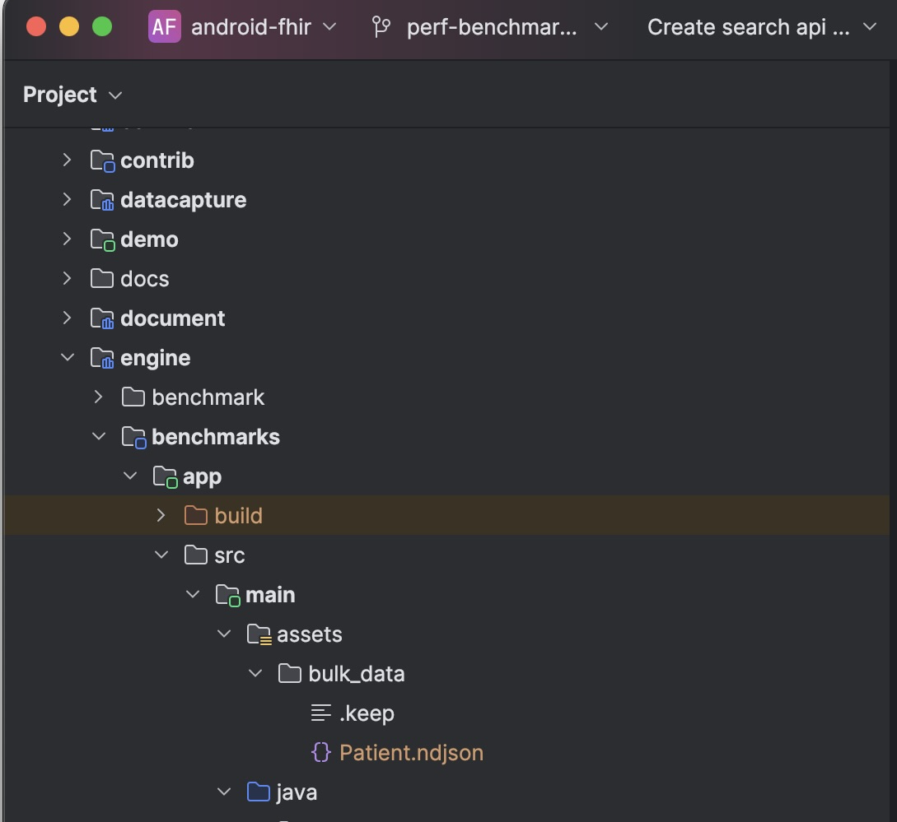

# _FHIR Engine Library_ Benchmark App

The _FHIR Engine Library_ Benchmark app runs benchmarks for the _FHIR Engine Library_ APIs including Data Access API, Search API and Sync API.

It can be configured to run the benchmarks for different population sizes whereby population refers to the number of Patients and their associated data

## Configuration

The benchmark app requires that the dataset that is to be benchmarked on be added in the _assets/bulk_data_ folder as `.ndjson` formatted files; whereby each line refers to a single FHIR resource



The dataset can be from an external source. Within the repository, there is a script to generate [synthetic data](https://github.com/synthetichealth/synthea/wiki/Getting-Started) that could then be used for benchmarking.

```shell
./gradlew :engine:benchmark:app:generateSynthea -Ppopulation=1000
```

It generates [synthetic data](https://github.com/synthetichealth/synthea/wiki/Getting-Started) with a population size of 1000.
The `population` parameter determines the population size that would be used to generate the data

## Running

To run this app in Android Studio, [create a run/debug configuration](https://developer.android.com/studio/run/rundebugconfig) for the `:engine:benchmark:app` module using the [Android App](https://developer.android.com/studio/run/rundebugconfig#android-application) template and run the app using the configuration.

[Change the build variant](https://developer.android.com/studio/run#changing-variant) to `benchmark` for an optimised version of the app, for the best results

Alternatively, run the following command to build and install the benchmark APK on your device/emulator:

```shell
./gradlew :engine:benchmark:app:installBenchmark
```
