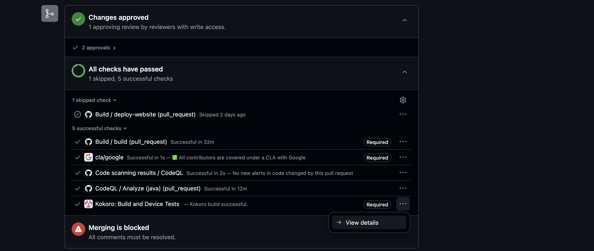
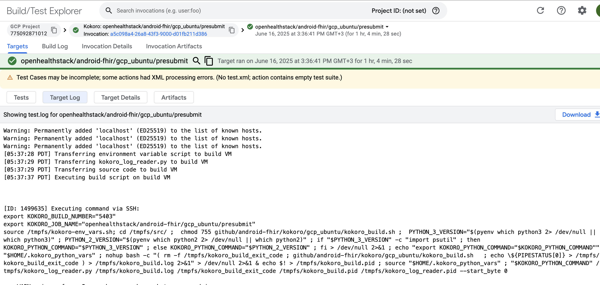
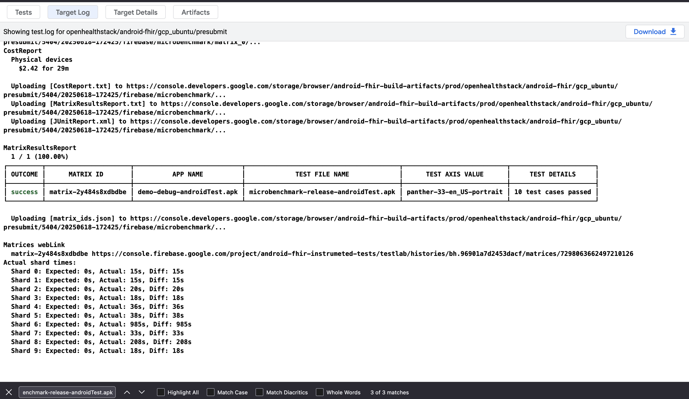
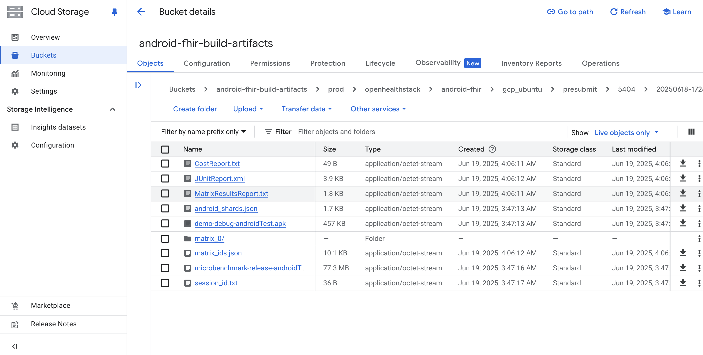
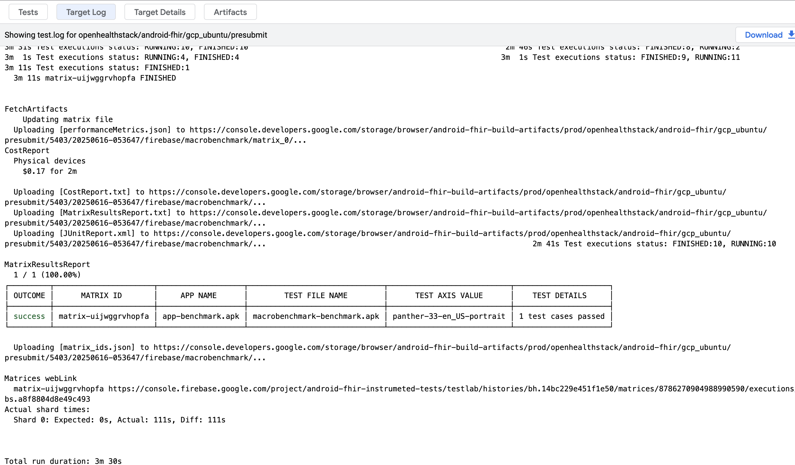
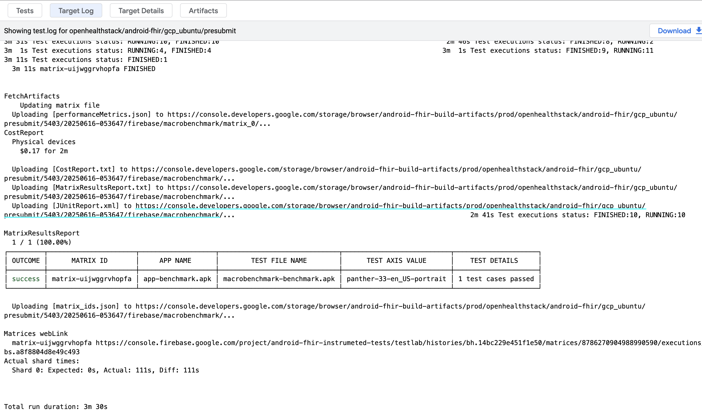
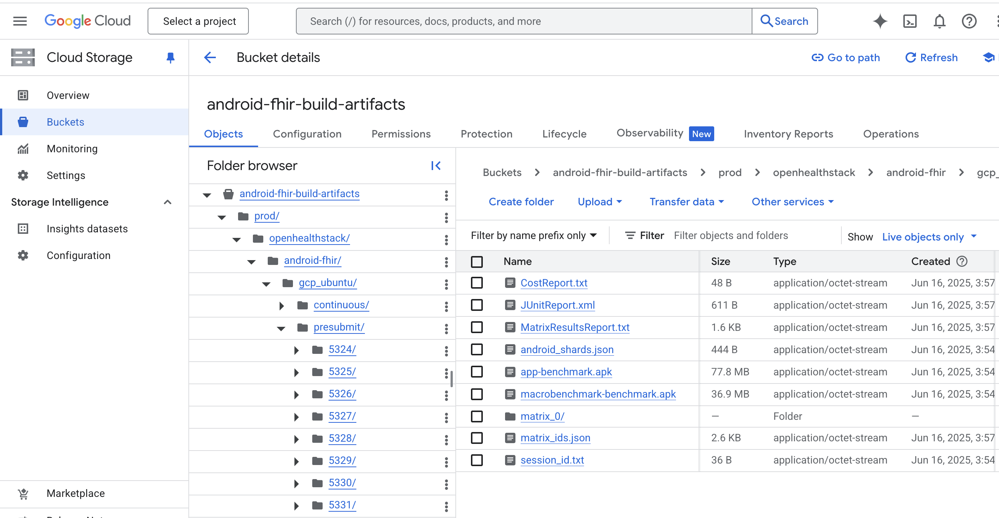

# _FHIR Engine Library_ Benchmarks

Benchmarks have been added in the _FHIR Engine Library_ to help track performance regressions
and areas for performance improvement.

The _FHIR Engine Library_ has the following benchmark modules

1. **app** - configurable android application for testing and running benchmarks
2. **microbenchmark** - [Jetpack Microbenchmark](https://developer.android.com/topic/performance/benchmarking/microbenchmark-overview) module
3. **macrobenchmark** - [Jetpack Macrobenchmark](https://developer.android.com/topic/performance/benchmarking/macrobenchmark-overview) module
to automate testing large-scale user-facing apis with the benchmark app

## App module

Located in the module `:engine:benchmarks:app`
The _FHIR Engine Library_ Benchmark app runs benchmarks for the _FHIR Engine Library_ APIs including Data Access API, Search API and Sync API.

It can be configured to run the benchmarks for different population sizes whereby population refers to the number of Patients and their associated data

### Configuration

The benchmark app requires that the dataset that is to be benchmarked on be added in the _assets/bulk_data_ folder as `.ndjson` formatted files; whereby each line refers to a single FHIR resource


The dataset can be from an external source. Within the repository, there is a script to generate [synthetic data](https://github.com/synthetichealth/synthea/wiki/Getting-Started) that could then be used for benchmarking.

```shell
./gradlew :engine:benchmarks:app:generateSynthea -Ppopulation=1000
```

It generates [synthetic data](https://github.com/synthetichealth/synthea/wiki/Getting-Started) with a population size of 1000.
The `population` parameter determines the population size that would be used to generate the data

### Running

To run this app in Android Studio, [create a run/debug configuration](https://developer.android.com/studio/run/rundebugconfig) for the `:engine:benchmarks:app` module using the [Android App](https://developer.android.com/studio/run/rundebugconfig#android-application) template and run the app using the configuration.

[Change the build variant](https://developer.android.com/studio/run#changing-variant) to `benchmark` for an optimised version of the app, for the best results

Alternatively, run the following command to build and install the benchmark APK on your device/emulator:

```shell
./gradlew :engine:benchmarks:app:installBenchmark
```

## Microbenchmark module

Contains test cases that evaluate the performance of individual tasks executed for the first time directly on hardware, located in the module `:engine:benchmarks:microbenchmark`.

The test cases are designed to run in sequence of their alphabetic order to make sure larger tasks do not build cache for smaller ones. Their class names are prefixed by an extra letter to inform their position relative to others in the list.

### Running

In Android Studio, set your build variants to `release` and run your benchmark as you would any `@Test` using the gutter action next to your test class or method.


The results will be similar to this:
```
1,297,374       ns        5345 allocs    trace    EngineDatabaseBenchmark.createAndGet
1,114,474,793   ns     4922289 allocs    trace    FhirSyncWorkerBenchmark.oneTimeSync_50patients
15,251,125      ns      100542 allocs    trace    FhirSyncWorkerBenchmark.oneTimeSync_1patient
179,806,709     ns      986017 allocs    trace    FhirSyncWorkerBenchmark.oneTimeSync_10patients
1,451,758       ns       11883 allocs    trace    GzipUploadInterceptorBenchmark.upload_10patientsWithGzip
1,537,559       ns       11829 allocs    trace    GzipUploadInterceptorBenchmark.upload_10patientsWithoutGzip
73,640,833      ns     1074360 allocs    trace    GzipUploadInterceptorBenchmark.upload_1000patientsWithGzip
7,493,642       ns      108428 allocs    trace    GzipUploadInterceptorBenchmark.upload_100patientsWithoutGzip
7,799,264       ns      108465 allocs    trace    GzipUploadInterceptorBenchmark.upload_100patientsWithGzip
71,189,333      ns     1074466 allocs    trace    GzipUploadInterceptorBenchmark.upload_1000patientsWithoutGzip

```

Alternatively, from the command line, run the connectedCheck to run all of the tests from specified Gradle module:

```bash
./gradlew :engine:benchmarks:microbenchmark:connectedReleaseAndroidTest
```

In this case, results will be saved to the `outputs/androidTest-results/connected/<device>/test-result.pb`. To visualize on Android Studio, click Run / Import Tests From File and find the `.pb` file

### Continuous Integration (CI)

#### Configuration

Microbenchmark tests are configured to run in Kokoro and use [Fladle](https://runningcode.github.io/fladle/) plugin, configured through `Project.configureFirebaseTestLabForMicroBenchmark` in file `buildSrc/src/main/kotlin/FirebaseTestLabConfig.kt`

#### Accessing the benchmark results

The Microbenchmark results can be accessed through the following steps

1. Click to `View details` of the `Kokoro: Build and Device Tests`
   

   The details page would look similar to
   
2. Within the `Target Log` tab, locate for the section
      
      with the `TEST FILE NAME` `microbenchmark-release-androidTest.apk`
3. Select and visit the Google Bucket url that looks as similar to
      [https://console.developers.google.com/storage/browser/android-fhir-build-artifacts/prod/openhealthstack/android-fhir/gcp_ubuntu/presubmit/5404/20250618-172425/firebase/microbenchmark](ttps://console.developers.google.com/storage/browser/android-fhir-build-artifacts/prod/openhealthstack/android-fhir/gcp_ubuntu/presubmit/5404/20250618-172425/firebase/microbenchmark)
   that navigates to the `android-fhir-build-artifacts` 
4. Navigate to `matrix_0/panther-33-en_US-portrait-test_results_merged.xml` to download the benchmark .xml results file. The `panther-33-en_US-portrait` in the path refers to the Firebase Test Lab device/shard used in running the benchmark tests.

## Macrobenchmark module

The _FHIR Engine Library_ macrobenchmark tests are located in the module `:engine:benchmarks:macrobenchmark`

### Prerequisite

Requires the _FHIR Engine Library_ Benchmark App configured with the relevant benchmark data described in the section for the _FHIR Engine Library_ Benchmark App

### Running

To run, use the command

```shell
./gradlew :engine:benchmarks:macrobenchmark:connectedCheck
```

### Continuous Integration (CI)

#### Configuration

The `FHIR Engine` Macrobenchmarks have been configured to run in Kokoro and use FirebaseTestLab physical devices

Configuration for the Kokoro script are currently located in `kokoro/gcp_ubuntu/kokoro_build.sh` while the FirebaseTestLab testing is configured through the [Fladle](https://runningcode.github.io/fladle/) plugin in `buildSrc/src/main/kotlin/FirebaseTestLabConfig.kt`

#### Accessing the benchmark results

From a GitHub PR , the following steps could be used to download the benchmark results from a Kokoro run

1. Click to `View details` of the `Kokoro: Build and Device Tests`
   

   The details page would look similar to
   

2. Within the `Target Log` tab, locate for the section
   
   with the `TEST FILE NAME` `macrobenchmark-benchmark.apk`

3. Select and visit the url as referenced in image
   
   representative of the Google Cloud Bucket containing the artifacts from the Kokoro run. From the image example, the url is [https://console.developers.google.com/storage/browser/android-fhir-build-artifacts/prod/openhealthstack/android-fhir/gcp_ubuntu/presubmit/5403/20250616-053647/firebase/macrobenchmark](https://console.developers.google.com/storage/browser/android-fhir-build-artifacts/prod/openhealthstack/android-fhir/gcp_ubuntu/presubmit/5403/20250616-053647/firebase/macrobenchmark)

   The bucket page would look similar to
   

4. Navigate to `matrix_0/panther-33-en_US-portrait/artifacts/sdcard/Download/com.google.android.fhir.engine.macrobenchmark-benchmarkData.json` to download the benchmark results file. The `panther-33-en_US-portrait` in the path represents the Firebase Test Lab device/shard that was used to run the benchmark tests.

#### Sample Benchmark Results

The results shared below are generated from running the _FHIR Engine Library_ Macrobenchmark tests in Kokoro

##### [**_Panther - Google Pixel 7_**](https://wiki.lineageos.org/devices/panther/)

**CPU** - Octa-core (2x2.85 GHz Cortex-X1 & 2x2.35 GHz Cortex-A78 & 4x1.80 GHz Cortex-A55)

**RAM** - 8GB

API 33

###### Data Access API results

Generated from execution of `FhirEngineCrudBenchmark` test in the `engine:benchmarks:macrobenchmark` module located at `engine/benchmarks/macrobenchmark/src/main/java/com/google/android/fhir/engine/macrobenchmark/FhirEngineCrudBenchmark.kt`

| API    | Average duration (ms) | Notes                                 |
|:-------|----------------------:|---------------------------------------|
| create |                  ~4.7 | Takes ~47s for population size of 10k |
| update |                ~12.29 |                                       |
| get    |                 ~3.83 |                                       |
| delete |                 ~8.08 |                                       |

###### Search DSL API

Generated from the execution of the `FhirEngineSearchApiBenchmark` test in the file `engine/benchmarks/macrobenchmark/src/main/java/com/google/android/fhir/engine/macrobenchmark/FhirEngineSearchApiBenchmark.kt`.

*_Data preloaded contains Patients with associated resources; Encounters/Practitioners/Organization/Location_

|                                             | Population size | Average duration (ms)<br/>_∣ϵ∣≤20 ms_ | Notes |
|---------------------------------------------|----------------:|--------------------------------------:|-------|
| searchPatientGivenWithDisjunctValues        |             10k |                                ~34.47 |       |
| searchEncounterLocalLastUpdated             |             10k |                               ~428.07 |       |
| searchPatientHasEncounter                   |             10k |                               ~104.66 |       |
| searchPatientSortedByBirthDate              |             10k |                               ~612.62 |       |
| searchPatientSortedByName                   |             10k |                               ~497.06 |       |
| searchPatientWithIncludeGeneralPractitioner |             10k |                                 ~9.53 |       |
| searchPatientWithRevIncludeConditions       |             10k |                                 ~8.32 |       |
| searchPatientIdWithTokenIdentifier          |             10k |                                ~11.11 |       |
| searchPatientWithEitherGivenNameOrBirthDate |             10k |                                ~16.17 |       |
| searchWithTypeDateSearchParameter           |             10k |                                 ~5.65 |       |
| searchWithTypeNumberSearchParameter         |             10k |                                 ~1.68 |       |
| searchWithTypeQuantitySearchParameter       |             10k |                                 ~3.12 |       |
| searchWithTypeStringSearchParameter         |             10k |                                ~24.49 |       |
