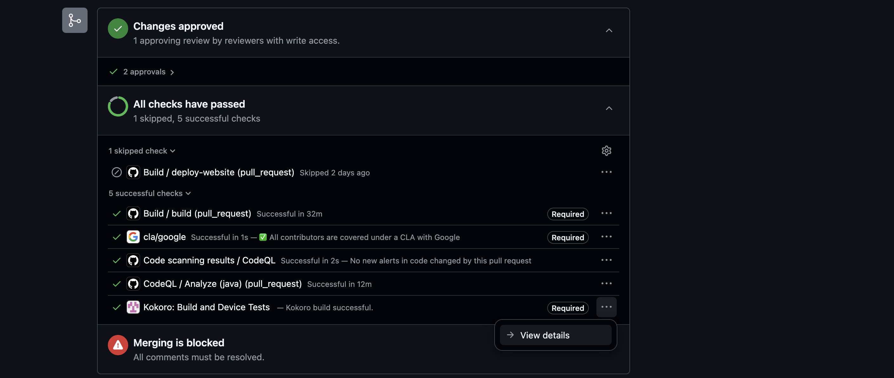
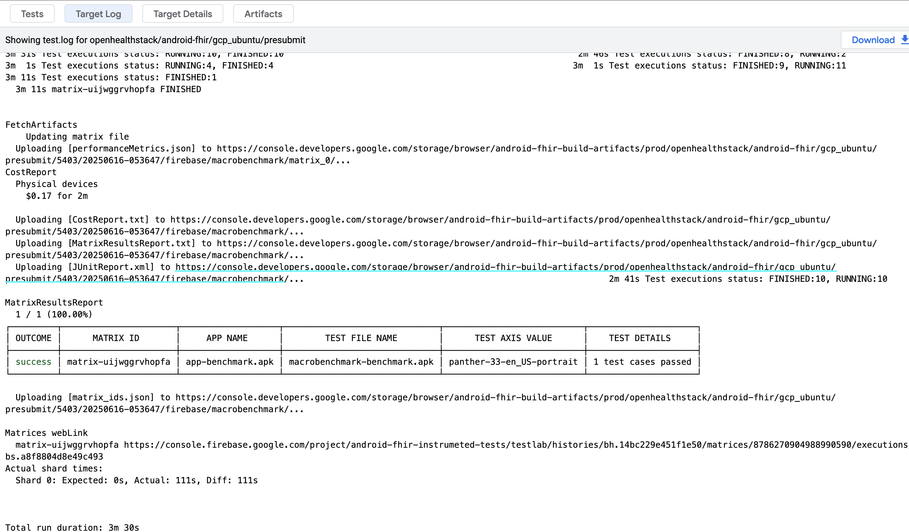

# _FHIR Engine Library_ Macrobenchmark

The _FHIR Engine Library_ macrobenchmark tests are located in the module `:engine:benchmark:macrobenchmark`

It uses the _FHIR Engine Benchmark app_ and as a prerequisite it requires that app be [configured with the relevant benchmark data](Benchmark-app.md)

Macrobenchmarks can be run using the command

```shell
./gradlew :engine:benchmark:macrobenchmark:connectedCheck
```

## Macrobenchmark in Continuous Integration (CI)

### Configuration

The `FHIR Engine` Macrobenchmarks have been configured to run in Kokoro CI and use FirebaseTestLab physical devices

Configuration for the Kokoro script are currently located in `kokoro/gcp_ubuntu/kokoro_build.sh` while the FirebaseTestLab testing is configured through the [Fladle](https://runningcode.github.io/fladle/) plugin in `buildSrc/src/main/kotlin/FirebaseTestLabConfig.kt`

### Accessing the benchmark results

From a GitHub PR , the following steps could be used to download the benchmark results from a Kokoro run

1. Click to `View details` of the `Kokoro: Build and Device Tests`
    

    The details page would look similar to
    

2. Within the `Target Log` tab, search for the section
    
    with the `TEST FILE NAME` `macrobenchmark-benchmark.apk`

3. Select, copy and visit the url as referenced in image
    
    representative of the Google Cloud Bucket containing the artifacts from the Kokoro run. From the image example, the url is [https://console.developers.google.com/storage/browser/android-fhir-build-artifacts/prod/openhealthstack/android-fhir/gcp_ubuntu/presubmit/5403/20250616-053647/firebase/macrobenchmark](https://console.developers.google.com/storage/browser/android-fhir-build-artifacts/prod/openhealthstack/android-fhir/gcp_ubuntu/presubmit/5403/20250616-053647/firebase/macrobenchmark)

    The bucket page would look similar to
    

4. Navigate to `matrix_0/panther-33-en_US-portrait/artifacts/sdcard/Download/com.google.android.fhir.engine.macrobenchmark-benchmarkData.json` to download the benchmark results file. The `panther-33-en_US-portrait` in the path represents the Firebase Test Lab device that was used to run the benchmark tests, which could change.
