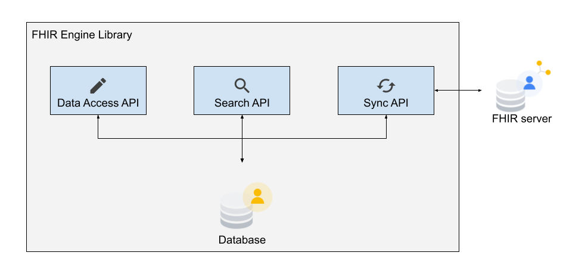

# FHIR Engine Library

The _FHIR Engine Library_ is a Kotlin library that makes it easy to manage FHIR resources on Android and synchronize them with FHIR servers.

Today, there are a growing number of tools and software libraries supporting the use of [FHIR](https://www.hl7.org/fhir/) on various platforms. However, developer support for FHIR on Android is still lacking. Typically, Android healthcare applications still use proprietary data models, and as a result, suffer from a lack of interoperability. The FHIR Engine Library addresses this problem by provding a set of APIs to help manage FHIR resources on Android, allowing easier integration with other software systems using FHIR.

## FHIR Engine Library components

The FHIR Engine library comprises an SQLLite database for offline storage of FHIR Resources and a suite of APIs (sync, search, data-access) for managing FHIR resources on the device.

### Local db for offline storage of FHIR resources

* The backbone of the FHIR Engine Library is the **SQLite database** storing FHIR resources in serialized JSON format
* Data stored in the on device storage is **[stored securely](Privacy-Security.md)**
* The database has **indexes for enabling fast retrieval** of resources based on [FHIR Search](https://www.hl7.org/fhir/search.html)

### FHIR Engine APIs

* **Data Access API**: basic access to local FHIR resources, namely, the CRUD operations: create, read, update, and delete. This relies on the HAPI FHIR Structures libraries ([api docs](https://hapifhir.io/hapi-fhir/apidocs/hapi-fhir-structures-r4/) | [documentation](https://hapifhir.io/hapi-fhir/docs/model/working_with_resources.html))
* **Search API**: a Kotlin DSL (domain-specific language) for searching local FHIR resources
* **Sync API**: synchronizes local FHIR resources with a remote FHIR server/store (such as [HAPI FHIR](https://hapifhir.io/hapi-fhir//) or [Google Cloud Healthcare API](https://cloud.google.com/healthcare-api/docs/how-tos/fhir))
