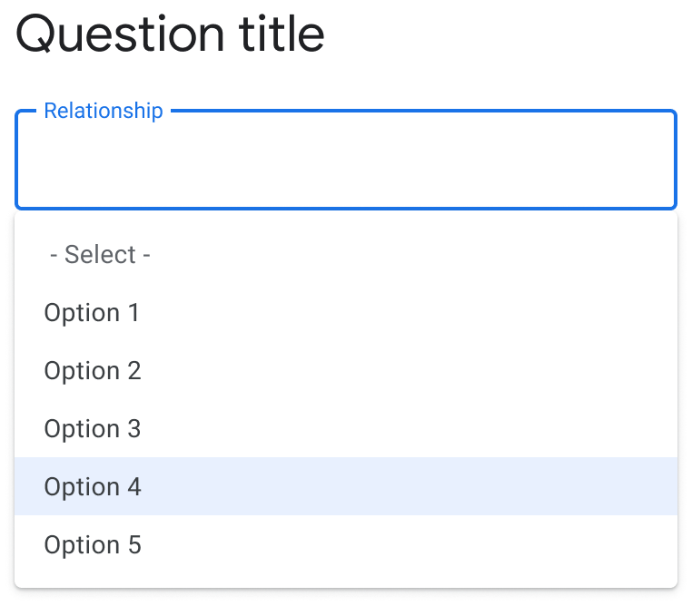

# FHIR specification support

There are two specifications that serve as requirements for the library:

* [FHIR Questionnaire](https://www.hl7.org/fhir/questionnaire.html)
* [Structured Data Capture Specification](http://hl7.org/fhir/uv/sdc/)

In this section, we will provide details on how each requirement in these two specifications is supported by the library.

## FHIR Questionnaire

### Questionnaire item

The following table summarizes the library's support for the key fields in the [questionnaire item element](https://www.hl7.org/fhir/questionnaire-definitions.html#Questionnaire.item).

|                   | Support | Notes                           |
|:------------------|:-------:|:--------------------------------|
| linkId            | ✅      |                                 |
| definition        | ✅      | See [Definition-based extraction](http://build.fhir.org/ig/HL7/sdc/extraction.html#definition-based-extraction) |
| code              | ⛔️      |                                 |
| prefix            | ✅      |                                 |
| text              | ✅      |                                 |
| type              | ✅      | See [Questionnaire item type](#questionnaire-item-type) |
| enableWhen        | ✅      |                                 |
| enableBehavior    | ✅      |                                 |
| required          | ✅      |                                 |
| repeats           | ✅      |                                 |
| readOnly          | ✅      |                                 |
| maxLength         | ✅      | For text only                   |
| answerConstraint  | ⛔️      |                                 |
| answerValueSet    | ✅      |                                 |
| answerOption      | ✅      |                                 |
| initial           | ✅      |                                 |
| item              | ⚠️       | Items nested under group are supported (see [#726](https://github.com/google/android-fhir/issues/726)); items nested under non-group questions are not yet supported (see [#910](https://github.com/google/android-fhir/issues/910)). |

### Questionnaire item type

The following table summarizes the library's support for [questionnaire item types](https://www.hl7.org/fhir/codesystem-item-type.html).

|Item type          | Support | Example                                                                                                     | Notes                                                        |
|:------------------|:-------:|:------------------------------------------------------------------------------------------------------------|:-------------------------------------------------------------|
| Group             | ✅      |                                                                                                                    |                                                              |
| Display           | ✅      |                                                                                                                    |                                                              |
| Question          | ✅      |                                                                                                                    | See sub-types below                                          |
| Boolean           | ✅      | [JSON](https://github.com/google/android-fhir/blob/master/catalog/src/main/assets/component_boolean_choice.json)   |                                                              |
| Decimal           | ✅      |                                                                                                                    |                                                              |
| Integer           | ✅      |                                                                                                                    |                                                              |
| Date              | ✅      | [JSON](https://github.com/google/android-fhir/blob/master/catalog/src/main/assets/component_date_picker.json)      |                                                              |
| Date time         | ✅      | [JSON](https://github.com/google/android-fhir/blob/master/catalog/src/main/assets/component_date_time_picker.json) |                                                              |
| Time              | ⛔️      |                                                                                                                    |                                                              |
| String            | ✅      |                                                                                                                    | Rendered as single-line text box                             |
| Text              | ✅      |                                                                                                                    | Rendered as multi-line text box                              |
| Url               | ⛔️      |                                                                                                                    |                                                              |
| Choice            | ✅      |                                                                                                                    |                                                              |
| ~~Open Choice~~   | ✅      |                                                                                                                    | Deprecated in R5. Use `answerConstraint` instead.            |
| Attachment        | ✅      | [JSON](https://github.com/google/android-fhir/blob/master/catalog/src/main/assets/component_attachment.json) |                                                              |
| Reference         | ⛔️      |                                                                                                                    |                                                              |
| Quantity          | ✅      |                                                                                                                    |                                                              |

## Structured Data Capture Specification

### Advanced form rendering

This section summarizes the library's support for [advanced form rendering](http://build.fhir.org/ig/HL7/sdc/rendering.html).

#### Text appearance

| Code               | Support | Example | Notes                    |
|:-------------------|:-------:|:--------|:-------------------------|
| rendering-style    | ⛔️      |         |                          |
| rendering-xhtml    | ⛔️      |         |                          |
| displayCatagory    | ⚠️       |         | `instructions` code only |
| openLabel          | ⛔️      |         |                          |
| hidden             | ✅      |         |                          |
| itemMedia          | ✅      | [JSON](https://github.com/google/android-fhir/blob/master/catalog/src/main/assets/component_item_media.json) |                          |
| itemAnswerMedia    | ✅      |         |                          |

#### Control appearance

| Control appearance | Support | Notes             |
|:-------------------|:--------|:------------------|
| itemControl        | ✅      | See below         |
| choiceOrientation  | ✅      |                   |
| sliderStepValue    | ✅      |                   |
| width              | ⛔️      |                   |
| collapsible        | ⛔️      |                   |

##### Item control

The [`itemControl`](https://build.fhir.org/ig/HL7/fhir-extensions/ValueSet-questionnaire-item-control.html) extension allows for the selection of a specific control widget for questionnaire items. See [example usage](http://build.fhir.org/ig/HL7/sdc/examples.html#itemControl). Item controls are only compatible with certain questionnaire item types (e.g. drop down item control cannot be applied to boolean type questions). This is listed in the `Compatible item type` column in the following table. Unsupported item controls are omitted in the table below.

| Item control  | Compatible item type | Example | Notes                                         | Image |
|:--------------|:---------------------|:--------|:----------------------------------------------|:-----:|
| Page          | Group                | [JSON](https://github.com/google/android-fhir/blob/master/catalog/src/main/assets/layout_paginated.json)              |                                               | |
| Fly-over      | Display              |         |                                               |
| Help-Button   | Display              | [JSON](https://github.com/google/android-fhir/blob/master/catalog/src/main/assets/component_help.json)                |                                               | |
| Auto-complete | Choice               | [JSON](https://github.com/google/android-fhir/blob/master/catalog/src/main/assets/component_auto_complete.json)       | Filter-forward based on inlined answerOptions | |
| Drop down | Choice               | [JSON](https://github.com/google/android-fhir/blob/master/catalog/src/main/assets/component_dropdown.json)            | Default for 4 or more answer options          |  |
| Check-box | Choice               | [JSON](https://github.com/google/android-fhir/blob/master/catalog/src/main/assets/component_multi_select_choice.json) | Default for repeat answers                    | |
| Radio Button | Choice               | [JSON](https://github.com/google/android-fhir/blob/master/catalog/src/main/assets/component_single_choice.json)       | Default for less than 4 answer options        | |
| Slider        | Integer              | [JSON](https://github.com/google/android-fhir/blob/master/catalog/src/main/assets/component_slider.json)              |                                               | |

#### Additional display content

| Code               | Support | Notes                                                           |
|:-------------------|:-------:|:----------------------------------------------------------------|
| supportLink        | ⛔️      |                                                                 |
| choiceColumn      | ⛔️      |                                                                 |
| optionPrefix       | ⛔️      |                                                                 |
| valueset-label     | ⛔️      |                                                                 |
| entryFormat      | ⚠️      | Used in SDC for user guidance, not for validation. However, we use it to validate date where appropriate. See [#1850](https://github.com/google/android-fhir/issues/1850).  |
| shortText          | ⛔️      |                                                                 |

#### Other

| Code                     | Support | Notes                              |
|:-------------------------|:-------:|:-----------------------------------|
| required                 | ✅      |                                    |
| repeats            | ✅      |                                    |
| readOnly                 | ✅      |                                    |
| rendering-styleSensitive | ⛔️      |                                    |
| optionalDisplay          | ⛔️      |                                    |

### Enhanced behavior

This section summarizes the library's support for [form behavior and calculation](http://hl7.org/fhir/uv/sdc/behavior.html).

#### Value constraints

The library supports the following [value constraints](http://hl7.org/fhir/uv/sdc/behavior.html#value-constraints) which limit the allowed values for answers.

| Value constraint   | Support | Notes         |
|:-------------------|:-------:|:--------------|
| maxLength          | ✅      | For text only |
| minLength      | ✅      | For text only |
| regex              | ✅      |               |
| minValue      | ✅      |               |
| maxValue      | ✅      |               |
| minQuantity        | ⛔️      |               |
| maxQuantity        | ⛔️      |               |
| maxDecimalPlaces   | ✅      |               |
| mimeType      | ⛔️      |               |
| maxSize            | ⛔️      |               |

#### Choice restriction

The library supports the following [choice restrictions](http://hl7.org/fhir/uv/sdc/behavior.html#choice-restriction). Note some of these are already covered in [Questionnaire item](#questionnaire-item) support.

| Choice restriction   | Support | Notes                           |
|:---------------------|:-------:|:--------------------------------|
| answerOption         | ✅      |                                 |
| answerValueSet       | ✅      |                                 |
| answerExpression     | ✅      |                                 |
| required             | ✅      |                                 |
| repeats              | ✅      |                                 |
| readOnly             | ✅      |                                 |
| minOccurs            | ⛔️      |                                 |
| maxOccurs            | ⛔️      |                                 |
| optionExclusive      | ✅      |                                 |
| unitOption           | ⛔️      |                                 |
| unitValueSet         | ⛔️      |                                 |
| referenceResource    | ⛔️      |                                 |
| referenceProfile     | ⛔️      |                                 |
| candidateExpression  | ✅      |                                 |
| lookupQuestionnaire  | ⛔️      |                                 |

#### Calculations

| Code                 | Support | Example | Notes                              |
|:---------------------|:-------:|:--------|:-----------------------------------|
| cqf-library          | ⛔️      |         |                                    |
| launchContext        | ✅      |         |                                    |
| variable             | ✅      |         |                                    |
| initialExpression    | ✅      |         |                                    |
| calculatedExpression | ✅      | [JSON](https://github.com/google/android-fhir/blob/master/catalog/src/main/assets/behavior_calculated_expression.json)                                    |
| cqf-calculatedValue  | ⛔️      |         |                                    |
| cqf-expression       | ⚠️       | [JSON](https://github.com/google/android-fhir/blob/master/catalog/src/main/assets/behavior_dynamic_question_text.json) | `text` only                        |

#### Other control

| Code                 | Support | Notes                              |
|:---------------------|:-------:|:-----------------------------------|
| entryMode            | ✅      |                                    |
| intial               | ✅      |                                    |
| enableWhen           | ✅      |                                    |
| enableWhenBehavior   | ✅      |                                    |
| enableWhenExpression | ✅      |                                    |
| usageMode            | ⛔️      |                                    |
| constraint           | ⛔️      |                                    |
| endpoint             | ⛔️      |                                    |
| signatureRequired    | ⛔️      |                                    |
| ordinalValue         | ⛔️      |                                    |
| text                 | ⛔️      |                                    |

## Expression extensions

This section summarizes the library's support for [expressions](http://build.fhir.org/ig/HL7/sdc/expressions.html).

| Name                         | Support | Example | Notes                                                       |
| ---------------------------- | :-----: | :------ | ----------------------------------------------------------- |
| variable                     | ✅      |         |                                                             |
| answerExpression             | ✅      |         |                                                             |
| initialExpression            | ✅      |         |                                                             |
| candidateExpression          | ⚠️       |         | [#1038](https://github.com/google/android-fhir/issues/1038) |
| contextExpression            | ⛔️      |         |                                                             |
| calculatedExpression         | ✅      | [JSON](https://github.com/google/android-fhir/blob/master/catalog/src/main/assets/behavior_calculated_expression.json) |                                                             |
| enableWhenExpression         | ✅      | [JSON](https://github.com/google/android-fhir/blob/master/catalog/src/main/assets/behavior_skip_logic.json) |                                                             |
| answerOptionToggleExpression | ⛔️      |         |                                                             |
| itemPopulationContext        | ⛔️      |         |                                                             |
| itemExtractionContext        | ⛔️      |         |                                                             |
| constraint                   | ⛔️      |         |                                                             |
| library                      | ⛔️      |         | [#1060](https://github.com/google/android-fhir/issues/1060) |
| launchContext                | ✅      |         |                                                             |
